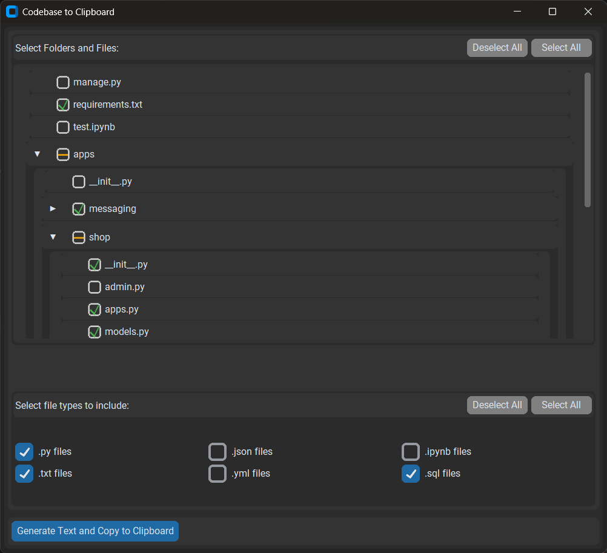

# 📂 Codebase to Clipboard

**The most efficient way to share your entire codebase with AI assistants!**

Transform your project into perfectly formatted, clipboard-ready text with either our **modern web interface** or **desktop application**.

## 🚀 Two Ways to Use

### 🌐 **Web Application** (NEW!)
Modern, clean web interface that runs in your browser:

```bash
python run.py
# Opens http://127.0.0.1:5000 automatically
```

### 🖥️ **Desktop Application** (Classic)
Traditional GUI application with CustomTkinter:

```bash
python .codebase-to-text.py
```



## 🌟 Why Choose Codebase to Clipboard?

Don't have premium access to GitHub Copilot, Cursor, or another AI-powered IDE? Tired of manually copying each file's code, managing filenames, and structuring your directories just so AI chatbots understand?

**Codebase to Clipboard** streamlines this entire process!

## ✨ Features

### 🎯 **Core Features**
- ✅ **Two interfaces**: Web app + Desktop app
- ✅ **Smart file selection** — visual tree with checkboxes 
- ✅ **File type filtering** — select specific extensions
- ✅ **One-click clipboard copy** with automatic formatting
- ✅ **Perfect for AI chatbots** — free and premium alike
- ✅ **Cross-platform** — Windows, macOS, Linux

### 🌐 **Web Application Features**
- ✅ **Modern responsive design** with dark theme
- ✅ **Runs in any browser** — no desktop installation needed
- ✅ **Live preview** — see generated output before copying
- ✅ **Quick access** — common directories at your fingertips
- ✅ **Real-time updates** — instant file counts and statistics

### 🖥️ **Desktop Application Features**  
- ✅ **Beautiful startup dialog** with project directory selection
- ✅ **Advanced directory browser** with intuitive navigation
- ✅ **Professional GUI** with dark theme and modern design
- ✅ **Project switching** — easily change between different projects
- ✅ **Custom directory selector** with themed interface

## ⚙️ Installation

Clone the repository:

```bash
git clone https://github.com/Alioninja/codeclip.git
cd codeclip
```

Install dependencies:

```bash
pip install -r requirements.txt
```

## 🎯 Quick Start

### 🌐 **Web App** (Recommended)

1. **Start the server:**
   ```bash
   python run.py
   ```

2. **Use in browser:**
   - Automatically opens http://127.0.0.1:5000
   - Select project directory
   - Choose files and file types
   - Generate and copy to clipboard
   - Paste into AI assistant

### 🖥️ **Desktop App**

1. **Run the application:**
   ```bash
   python .codebase-to-text.py
   ```

2. **Use the GUI:**
   - Beautiful startup dialog appears
   - Select project directory
   - Use checkboxes for files/folders
   - Click "Generate Text and Copy to Clipboard"

## 📤 Output Format

Both applications generate identical formatted output:

```
PROJECT DIRECTORY STRUCTURE:
├── src/
│   ├── components/
│   │   └── Button.jsx
│   └── utils/
│       └── helpers.js
└── package.json

==================== FILE CONTENTS ====================

FILE: src/components/Button.jsx
```jsx
import React from 'react';
const Button = ({ children, onClick }) => {
  return <button onClick={onClick}>{children}</button>;
};
export default Button;
```

FILE: package.json
```json
{
  "name": "my-app",
  "version": "1.0.0"
}
```
```

## 🎨 **Interface Comparison**

| Feature | Web App | Desktop App |
|---------|---------|-------------|
| Modern UI | ✅ | ✅ |
| Dark Theme | ✅ | ✅ |
| File Tree | ✅ | ✅ |
| Live Preview | ✅ | ❌ |
| Browser-based | ✅ | ❌ |
| Offline Use | ❌ | ✅ |
| Startup Dialog | ✅ | ✅ |
| Project Switching | ✅ | ✅ |

## 💡 **Pro Tips**

- **🔄 Quick Switching**: Use "Change Project" to work with multiple codebases
- **🎯 Smart Filtering**: Uncheck file types you don't need for focused analysis  
- **⚡ Bulk Operations**: "Select All" and "Deselect All" for quick selection
- **📋 Perfect for AI**: Generated format works perfectly with ChatGPT, Claude, etc.
- **🚀 Performance**: Handles large codebases efficiently with smart sampling

## 🛠️ **Technical Details**

### **Smart Directory Scanning**
- Automatically detects and categorizes file types
- Ignores common build/cache directories (`node_modules`, `__pycache__`, `.git`)
- Performance limits for large directories
- Cross-platform path handling

### **File Processing**
- Syntax highlighting markers for 30+ languages
- UTF-8 encoding with error handling  
- Relative path resolution
- Memory-efficient processing

### **Web Technologies**
- **Backend**: Flask web server
- **Frontend**: Vanilla JavaScript + CSS
- **Styling**: Modern responsive design
- **Icons**: Font Awesome

## 📋 **Requirements**

- **Python 3.7+**
- **Flask 2.3.3+** (for web app)
- **customtkinter** (for desktop app)  
- **Pillow** (for image processing)

All dependencies in `requirements.txt`.

## 🏗️ **Project Structure**

```
codeclip/
├── run.py                    # 🌐 Web app launcher
├── app.py                    # 🌐 Flask web server
├── codebase_core.py          # 📦 Core processing logic
├── .codebase-to-text.py      # 🖥️ Desktop app
├── templates/
│   └── index.html            # 🌐 Web interface
├── static/
│   ├── css/style.css         # 🎨 Web styling
│   └── js/app.js            # ⚡ Web functionality
└── requirements.txt          # 📦 Dependencies
```

## 📝 Contributing

Pull requests welcome! Please open an issue first to discuss changes.

## 📜 License

[MIT](LICENSE)

---

**Happy coding!** 🚀 Transform any codebase into AI-ready text in seconds!