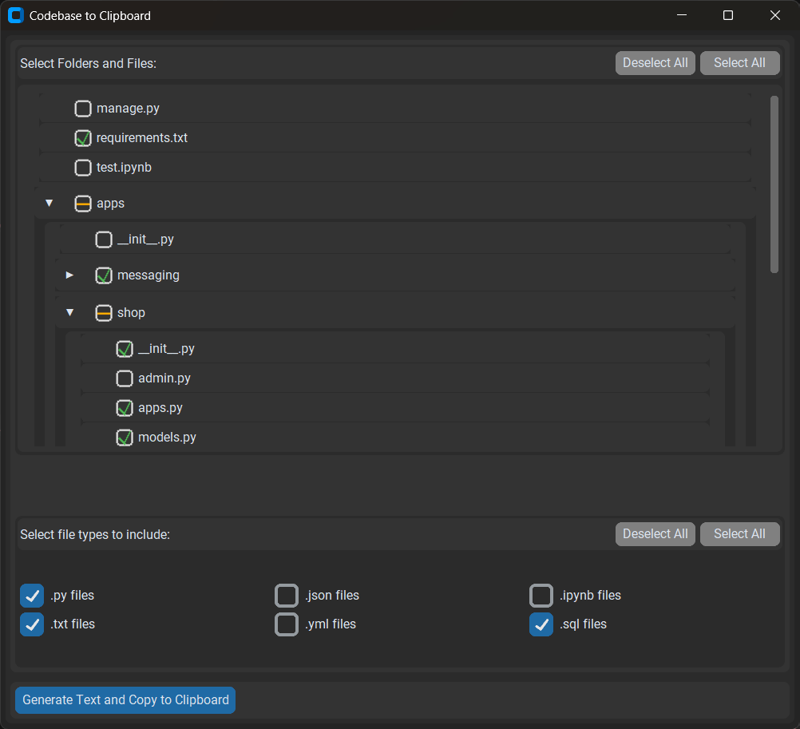

### 📂 Code Clip for AI

Don't have premium access to GitHub Copilot, Cursor, or another AI-powered IDE? Tired of manually copying each file's code, managing filenames, and structuring your directories just so AI chatbots understand?

**Code Clip for AI** streamlines this entire process, offering both a **GUI** and a **CLI**!

## 🚀 What does it do?

This Python utility offers two ways to interact with your codebase:

An intuitive **GUI** to visually select files and folders:



A flexible **Command-Line Interface (CLI)** for scripting and fine-grained control.

Both methods allow you to:

- Select files or entire directories within your project.
- Automatically generate a text representation including the directory tree and the content of selected files.
- Copy the output (to clipboard via GUI, to file or stdout via CLI).

Just paste the generated text into your favorite AI chatbot and ask your question!

Additionally, a separate utility helps you reverse the process, recreating the project structure from the generated text file – perfect for sharing or archiving!

## 🛠️ Features

✅ **User-friendly GUI** for clear directory visualization and easy selection.

✅ **Flexible CLI Mode**: For automation, scripting, and advanced filtering (include/exclude patterns, specific extensions, output to file, toggling tree/content).

✅ **One-click clipboard copy (GUI).**

✅ **Output to file or standard output (CLI).**

✅ **Project Restoration**: Recreate your project's structure and files from the generated text output using a separate script.

✅ **Ideal for use with free AI chatbots.**

## ⚙️ Installation

Clone the repository:

```bash
git clone https://github.com/Alioninja/codeclip.git
cd codeclip # Navigate into the cloned directory
```

Install dependencies (only needed for the GUI mode):

```bash
pip install -r requirements.txt
```

(The CLI and Restoration modes only use Python's standard libraries.)

## 🎯 Usage

The tool consists of two main scripts:

- **`codebase-to-text.py`**: Generates text from your codebase (GUI or CLI).
- **`text-to-codebase.py`**: Recreates the codebase from the generated text.

### Generating Text (`codebase-to-text.py`)

#### Graphical User Interface (GUI)

This is the default mode if you run the script without arguments.

1. Navigate to your project's root directory in your terminal.
2. Run the application (assuming the script is in the cloned `codeclip` directory, adjust path if needed):

   ```bash
   python path/to/codeclip/codebase-to-text.py
   ```

   ***(Replace `path/to/codeclip` with the actual path)***

3. The GUI will open, showing the structure of the directory you ran it from.
4. Choose your files, folders, or entire directory using the checkboxes.
5. Select the desired file types to include.
6. Click **Generate & Copy**.
7. Paste into your AI chatbot and ask away!

#### Command-Line Interface (CLI)

Use the `--cli` flag to activate CLI mode. Run these commands from your project's root directory or specify the target directory.

- **Basic run (current directory, output to console):**
  
  ```bash
  python path/to/codeclip/codebase-to-text.py --cli .
  ```

- **Specify directory, include only `.py` and `.js` files, output to `output.txt`:**
  
  ```bash
  python path/to/codeclip/codebase-to-text.py --cli /path/to/your/project -i .py .js -o output.txt
  ```

- **Exclude `node_modules`, `build` directory, and `.log` files:**
  
  ```bash
  python path/to/codeclip/codebase-to-text.py --cli . -e node_modules/ build/ *.log
  ```

- **List all detected file extensions and exit:**
  
  ```bash
  python path/to/codeclip/codebase-to-text.py --cli . --list-exts
  ```

- **Generate output without file content (tree only):**
  
  ```bash
  python path/to/codeclip/codebase-to-text.py --cli . --no-content
  ```

- **See all options:**
  
  ```bash
  python path/to/codeclip/codebase-to-text.py --cli --help
  ```

### Restoring from Text (`text-to-codebase.py`)

Use this script to recreate the project structure from a file generated by `codebase-to-text.py`.

- **Restore `project_dump.txt` into a new directory named `restored_project`:**
  
  ```bash
  python path/to/codeclip/text-to-codebase.py project_dump.txt -o restored_project
  ```

- **Restore into the current directory, overwriting existing files:**
  
  ```bash
  python path/to/codeclip/text-to-codebase.py project_dump.txt -o . --force
  ```

  *(Use `--force` with caution!)*

## 📝 Contributing

Pull requests are welcome! Please open an issue first to discuss changes.

## 🐟 License

MIT

Happy coding! 🚀

