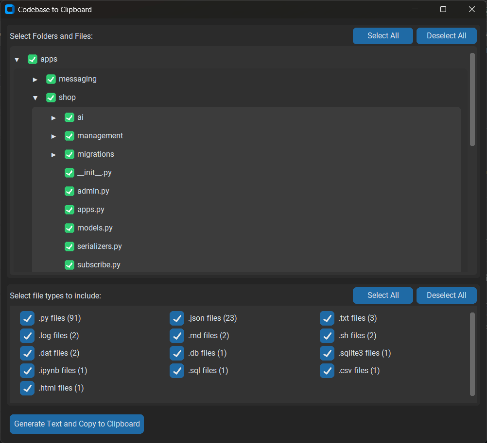

# 📂 Code Clip for AI

Don't have premium access to GitHub Copilot, Cursor, or another AI-powered IDE? Tired of manually copying each file's code, managing filenames, and structuring your directories just so AI chatbots understand?

**Code Clip for AI** streamlines this entire process with a beautiful, intuitive interface!

## 🚀 What does it do?

This powerful Python app offers an advanced GUI with professional directory selection to:



- **🎨 Beautiful startup dialog** with project directory selection
- **📁 Advanced directory browser** with intuitive navigation
- **🔄 Project switching** — easily change between different projects
- **📋 Smart file selection** with visual directory trees
- **⚡ One-click clipboard copy** with automatic formatting

Just paste into your favorite AI chatbot and ask your question!

## 🛠️ Features

### 🎯 **Core Features**
- ✅ **Professional GUI** with dark theme and modern design
- ✅ **Smart project selection** — startup dialog for choosing directories
- ✅ **Easy file selection** — visual tree with checkboxes for files and folders
- ✅ **Instant clipboard copy** with properly formatted output
- ✅ **Perfect for AI chatbots** — free and premium alike

### 🎨 **Advanced Interface**
- ✅ **Custom directory selector** with beautiful themed interface
- ✅ **Interactive navigation** with clickable folders and back button
- ✅ **Real-time file counting** and extension detection
- ✅ **Responsive design** that adapts to window size
- ✅ **Address bar navigation** with click-to-browse functionality

### 🔄 **Project Management**
- ✅ **Project switching** — change directories anytime with "Change Project" button
- ✅ **Dynamic file type detection** — automatically scans and categorizes files
- ✅ **Smart filtering** — select specific file types or entire directories
- ✅ **Persistent state** — remembers your selections within sessions

### 🚀 **User Experience**
- ✅ **Intuitive navigation** with "↰ Up Directory" button
- ✅ **Clean, uncluttered interface** — no redundant information
- ✅ **Efficient space usage** — maximum content in minimal space
- ✅ **Professional appearance** — secondary colors for navigation aids

## ⚙️ Installation

Clone the repository:

```bash
git clone https://github.com/Alioninja/codeclip.git
cd codeclip
```

Install dependencies:

```bash
pip install -r requirements.txt
```

## 🎯 Usage

### 🚀 **Getting Started**

1. Run the application from any directory:

```bash
python .codebase-to-text.py
```

2. **Choose your project directory:**
   - Beautiful startup dialog appears automatically
   - Select current directory or browse to a different project
   - Professional interface with address bar and navigation

3. **Select your content:**
   - Browse directories with the intuitive file tree
   - Use checkboxes to select specific files or entire folders
   - Filter by file types with the smart detection system
   - Switch projects anytime with "Change Project" button

4. **Generate and copy:**
   - Click **"Generate Text and Copy to Clipboard"**
   - Properly formatted content is copied instantly
   - Paste directly into any AI chatbot

5. **Ask your questions!**
   - Content includes file paths and directory structure
   - Perfect for AI code analysis, debugging, and enhancement

### 💡 **Pro Tips**

- **🔄 Project Switching**: Use "Change Project" to work with multiple codebases
- **📁 Smart Navigation**: Click the address bar or use "↰ Up Directory" button
- **🎯 File Filtering**: Uncheck file types you don't need for focused analysis
- **📏 Efficient Browsing**: Compact folder items show more directories at once
- **⚡ Quick Selection**: "Select All" and "Deselect All" buttons for bulk operations

## 🎨 **Interface Highlights**

### **Directory Selection Dialog**
- 🚀 Welcome screen with project selection
- 📍 Address bar with click-to-browse functionality  
- 🔙 Reliable "Up Directory" navigation
- 📄 File count display in footer
- 🎨 Consistent dark theme matching main application

### **Main Application**  
- 🗂️ Visual directory tree with expand/collapse
- ☑️ Smart file type detection and filtering
- 📊 Real-time file counting and statistics
- 🔄 Seamless project switching without restart

## 🔧 **Technical Features**

- **🎯 Smart Directory Scanning**: Automatically detects and categorizes all file types
- **📦 Optimized Performance**: Efficient scanning with limits for large directories
- **🛡️ Robust Error Handling**: Graceful handling of permission errors and invalid paths
- **💾 Memory Efficient**: Proper cleanup and resource management
- **🖥️ Cross-Platform**: Works on Windows, macOS, and Linux
- **⚡ Responsive UI**: Smooth interactions and proper window management

## 📋 **Requirements**

- **Python 3.7+**
- **customtkinter** - Modern UI framework
- **Pillow** - Image processing for UI elements

All dependencies are listed in `requirements.txt` for easy installation.

## 🆕 **What's New**

### **Version 2.0 - Major Interface Overhaul**

- 🎨 **Complete UI redesign** with professional directory selection
- 🚀 **Startup project selection** with beautiful themed dialog
- 📁 **Advanced directory browser** with address bar and navigation
- 🔄 **Project switching capability** without restarting the application
- ⚡ **Improved performance** with better file scanning and UI updates
- 🎯 **Space-optimized interface** with compact folder items
- 🛡️ **Enhanced error handling** and user feedback

### **Navigation Improvements**
- ↰ **Up Directory button** with clear, intuitive labeling
- 📍 **Click-to-browse address bar** for quick navigation
- 🔄 **Automatic scroll reset** when navigating directories
- 📊 **File count display** moved to footer for cleaner interface

## 📝 Contributing

Pull requests are welcome! Please open an issue first to discuss changes.

## 📜 License

[MIT](LICENSE)

---

Happy coding! 🚀

